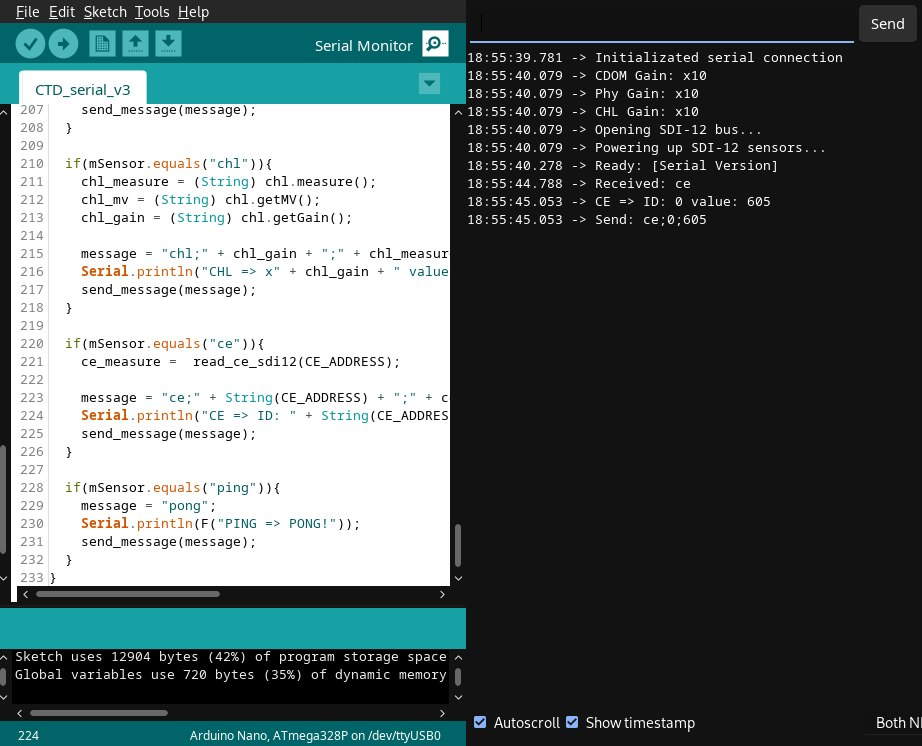
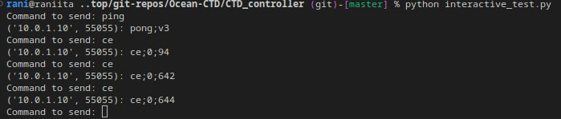
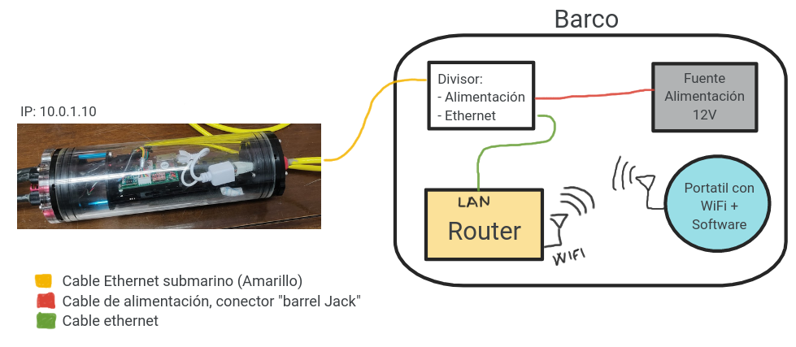
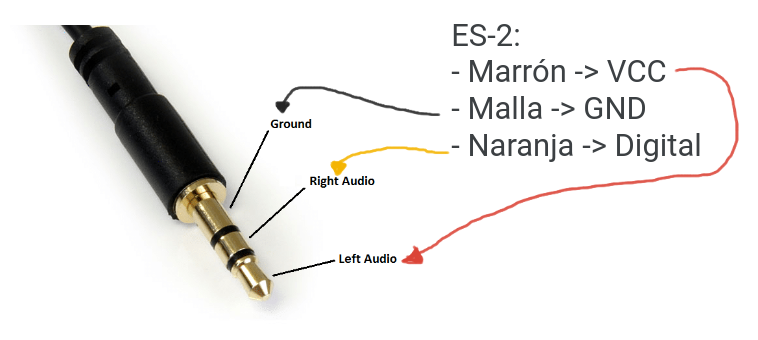

# Upgrade to v3

## Features

* Add electrical conductivity ([ES-2](https://www.metergroup.com/en/meter-environment/products/es-2-electrical-conductivity-temperature-sensor)) sensor to hardware prototype. 
* Remove temperature sensor (TSYS01) because constraints of space.
* General cleaning of code. Try to reduce program size.
* New API endpoint on Hardware, keyword: ``ce``
* API endpoint ``ping``, returns info about hardware version.

## API Endpoints on Hardware:
* ``cdom``
* ``phy``
* ``chl``
* ``ms5``
* ``ce``
* ``ping``

## Tests

*Note: tests using tap water*

## Physical connections

## Connector for ES-2 Sensor

## Deploy notes

* Yellow Router USB cable could be connect to power brick (example: mobile phone charger). There isnt data flowing in that USB, only power.
* Yellow Router IP: 10.0.1.1, using OpenWRT. Password: _the classic ones_
* The Probe has Static IP (10.0.1.10), forced by the router.
* The Router expose the WiFi called `Boat`. Its able to use and should connect OK with the probe.